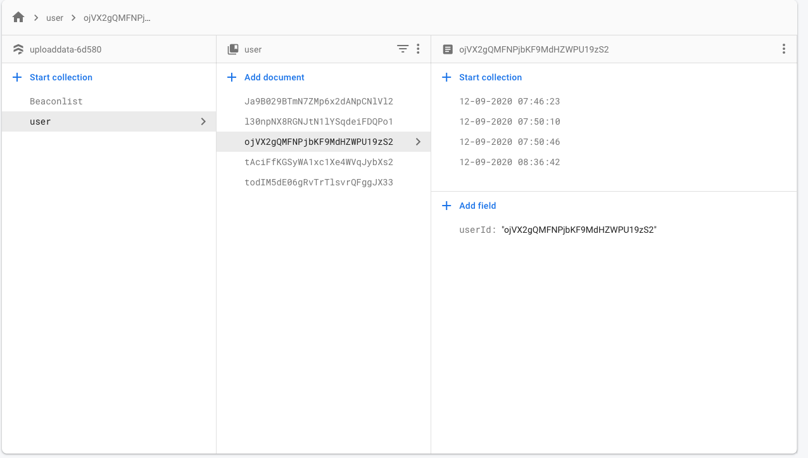
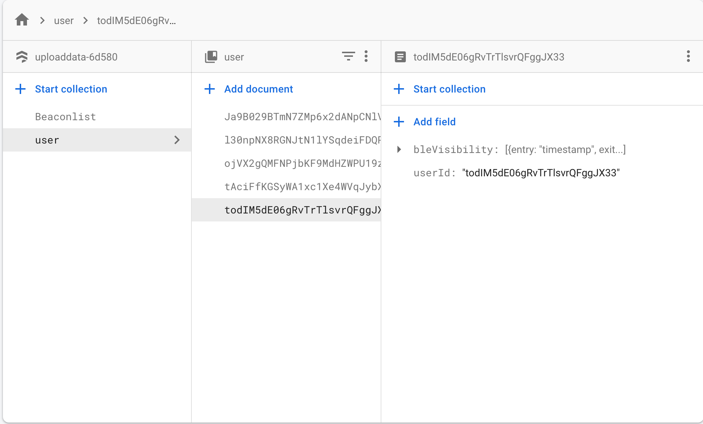

# CovidGuard

Mobile travel application that provide user the ability to book travel ticket and obtain covid information in countries around the world.

## Table of Contents

- [Description](#description)
- [Screenshots](#screenshots)
- [Technologies Used](#technologies-used)
- [Installation](#installation)
- [Features](#features)

## Installation

Clone this repository and import into **Android Studio**

```bash
git clone https://github.com/MwangiR/CovidGuard
```

## Instructions to run the app (Method 1)

- Click on **Run** button ▶ in **Android Studio**

## Instructions to run the app (Method 2)

1. Move into the cloned directory
2. Run gradle command to build an apk
3. Install the apk into virtual device

```bash
gradlew build
gradlew install# Contact Tracing App
```

## Description

The Contact Tracing App is designed to utilize Bluetooth Low Energy (BLE) technology for contact tracing, helping to track and prevent the spread of infectious diseases such as COVID-19.

## Screenshots




## Technologies Used

- Android SDK
- BLE Framework
- Firebase Authentication
- Firestore
- Java

## Installation

1. Clone the repository.
2. Set up Firebase project and add the google-services.json file to the Android app.
3. Install dependencies (`npm install`).
4. Run the Android application on an emulator or physical device.

## Features

- Utilizes BLE technology for contact tracing.
- Stores user-specific data in Firestore.
- Registers devices for notifications and stores FCM tokens in Firestore.

## Usage Information

1. Clone the repository.
2. Set up Firebase project and add the google-services.json file to the Android app.
3. Install dependencies (`npm install`).
4. Run the Android application on an emulator or physical device.
5. Ensure Bluetooth is enabled on the device to enable contact tracing.

## Suggested Future Development

- Implement more advanced contact tracing algorithms.
- Enhance user interface for better user experience.

## Contribution Guidelines

- Fork the repository.
- Create a new branch (`git checkout -b feature/xyz`).
- Make your changes.
- Commit your changes (`git commit -am 'Add new feature'`).
- Push to the branch (`git push origin feature/xyz`).
- Create a new Pull Request.

## Test Instructions

- Use the app in various scenarios to ensure accurate contact tracing.
- Test Bluetooth connectivity and data transmission.

## License

This project is licensed under the [MIT] - see the LICENSE.md file for details.

## Questions

For any questions or support

```

## Basic Features of the App:

- Onboard page
- Firebase login authentication
- Google authentication
- Covid Stats
- Clickable location cards with description

## Screenshots of Application

  

## Contributing

1. Fork it
2. Create your feature branch (git checkout -b my-new-feature)
3. Commit your changes (git commit -m 'Add some feature')
4. Push your branch (git push origin my-new-feature)
5. Create a new Pull Request
```
